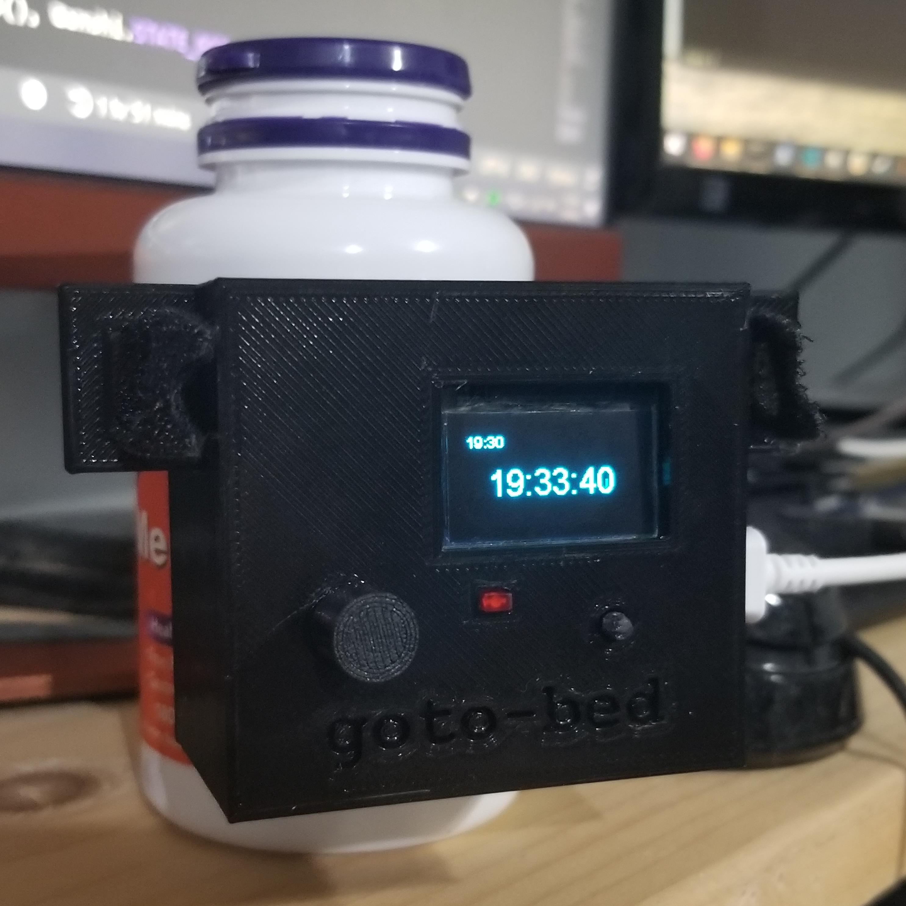
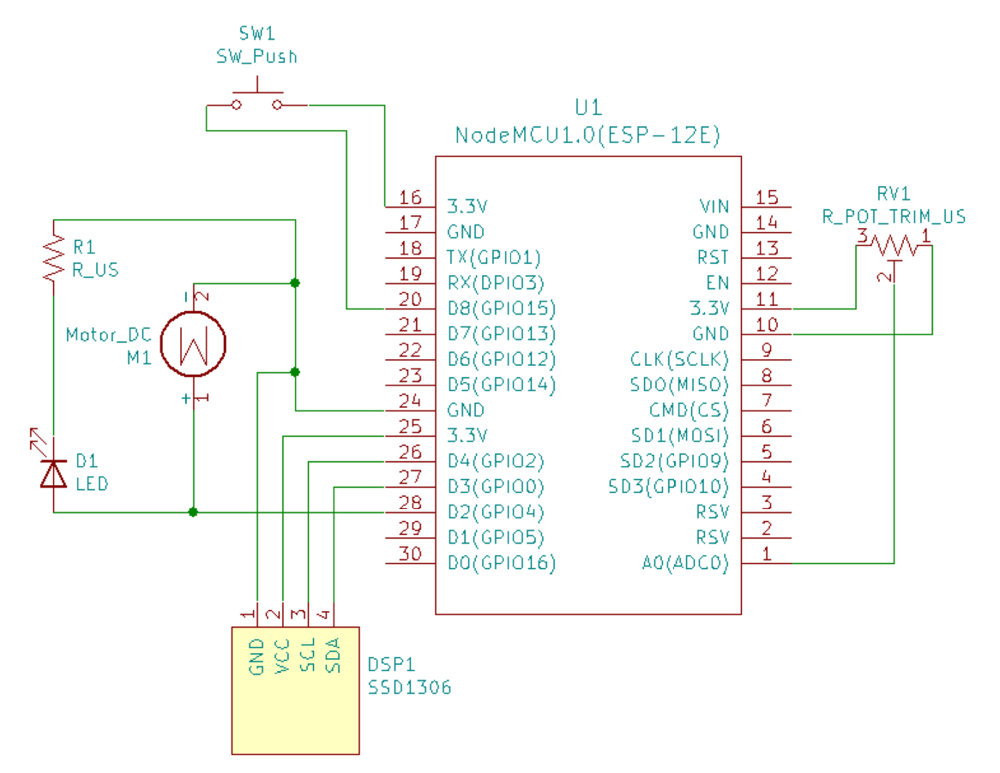
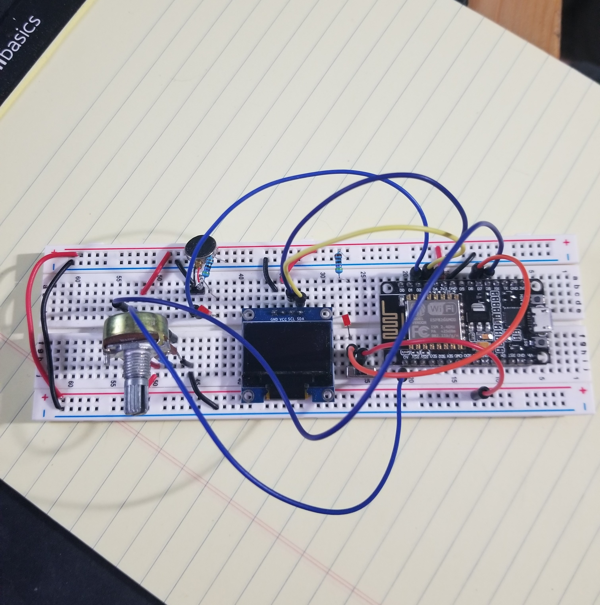
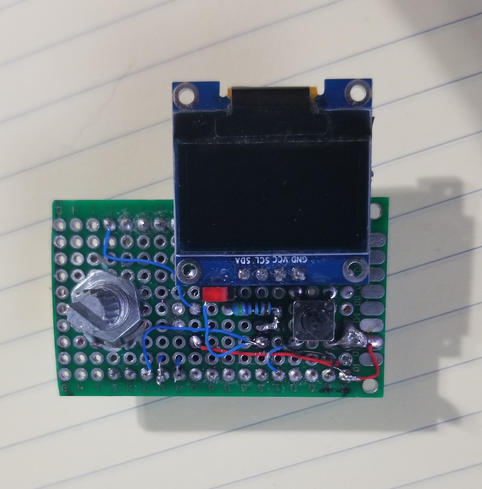
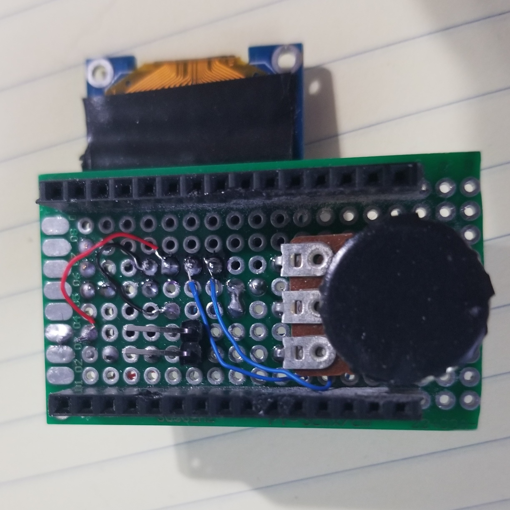

# goto-bed
Making my melatonin bottle vibrate so I know its time to go to bed.

I just wanted a little project to work on to learn Fusion 360 and a bit of KiCad.

<figure align="center">
  
</figure>

## General Concept
- Send NTP request to get current time and resync every 5 minutes
- If current time equals alarm time, trigger vibration motors
- Press function button to acknowledge alarm, stop vibration motors, and reset state
- Take melatonin, get tired, and go to bed at a reasonable time (ideally)

### Setting the Alarm Time
- Press function button to transition to edit state
- Use potentiometer to set alarm time
- Press function button again to reset back to normal state

## Images

<figure align="center">
  
  <figcaption>
    Basic schematic
  </figcaption>
</figure>
 
<figure align="center">
  
  <figcaption>
    Breadboard prototype
  </figcaption>
</figure>
 
<figure align="center">
  
  <figcaption>
    Badly soldered circuit (top)
  </figcaption>
</figure>
 
<figure align="center">
  
  <figcaption>
    Badly soldered circuit (bottom)
  </figcaption>
</figure>

## Learned
This stupid project definitely made me learn some things.

- Analog read from potentiometer
- Fetch current time using UDP packet to NTP server
- Design a 3D printable enclosure with Fusion 360
- Make a schematic in KiCad with Eeschema

## Cut From Project
I wanted to do a couple more things, but decided to cut it short due to time.

- Power the circuit with rechargable battery (also redesign for low power usage)
- Design and order custom PCB
- Smaller enclosure => my enclosure design is disgustingly large
- Power switch

## References
- ESP8266_SSD1306 - https://github.com/ThingPulse/esp8266-oled-ssd1306
- NTP packet format - https://tools.ietf.org/html/rfc5905#section-7.3
- KiCad Symbol Libraries
  - [kicad-ESP8266](https://github.com/jdunmire/kicad-ESP8266)
  - [KiCad-SSD1306-128x64](https://github.com/pforrmi/KiCad-SSD1306-128x64)
